<div align="center">

# 🚀 XUB.DEV — Personal Portfolio

### A premium, hand-crafted portfolio website built with pure HTML, CSS & JavaScript

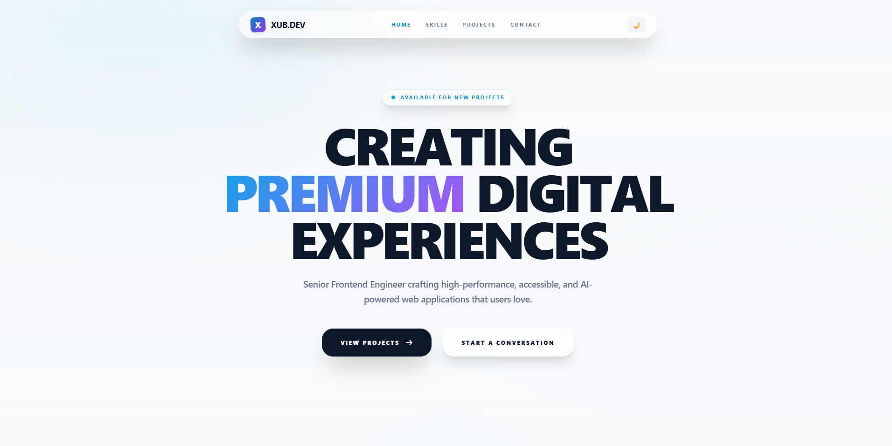

[](https://developer.mozilla.org/en-US/docs/Web/HTML)
[](https://developer.mozilla.org/en-US/docs/Web/CSS)
[](https://developer.mozilla.org/en-US/docs/Web/JavaScript)
[](LICENSE)

[**Live Demo**](https://xub.dev) · [**Report Bug**](https://github.com/username/xub-portfolio/issues) · [**Request Feature**](https://github.com/username/xub-portfolio/issues)

---

</div>

## 📑 Table of Contents

- [About The Project](#-about-the-project)
- [Screenshots](#-screenshots)
- [Features](#-features)
- [Tech Stack](#-tech-stack)
- [Project Structure](#-project-structure)
- [Getting Started](#-getting-started)
  - [Prerequisites](#prerequisites)
  - [Installation](#installation)
- [Usage](#-usage)
- [Customization](#-customization)
- [Performance](#-performance)
- [Browser Support](#-browser-support)
- [Roadmap](#-roadmap)
- [Contributing](#-contributing)
- [License](#-license)
- [Contact](#-contact)
- [Acknowledgments](#-acknowledgments)

---

## 📖 About The Project

**XUB.DEV** is a modern, responsive portfolio website designed for senior frontend engineers and creative developers. Built entirely **without CSS frameworks**, it demonstrates mastery of core web technologies through a clean, modular architecture.

The project showcases:

- **Design System Thinking** — CSS custom properties as design tokens
- **Component Architecture** — BEM methodology with modular CSS files
- **Modern JavaScript** — Module pattern, IntersectionObserver, localStorage
- **Accessibility** — Semantic HTML, ARIA labels, keyboard navigation
- **Performance** — No dependencies, lazy loading, optimized animations

---

## 📸 Screenshots

### 🌞 Light Mode

<details>
<summary>Click to expand light mode screenshots</summary>

#### Hero Section


#### Skills Section

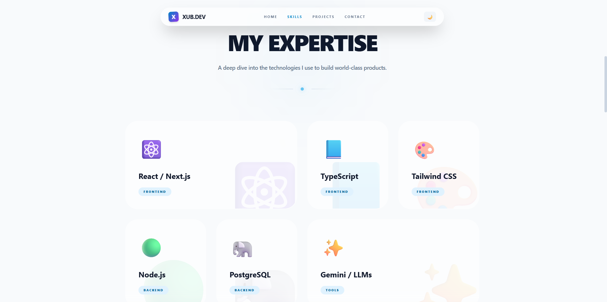

#### Projects Section

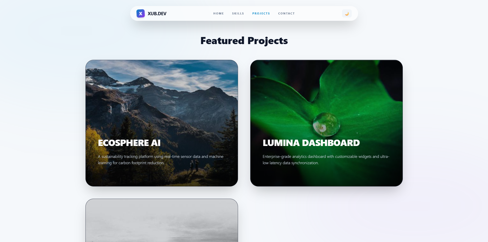

#### Contact Section

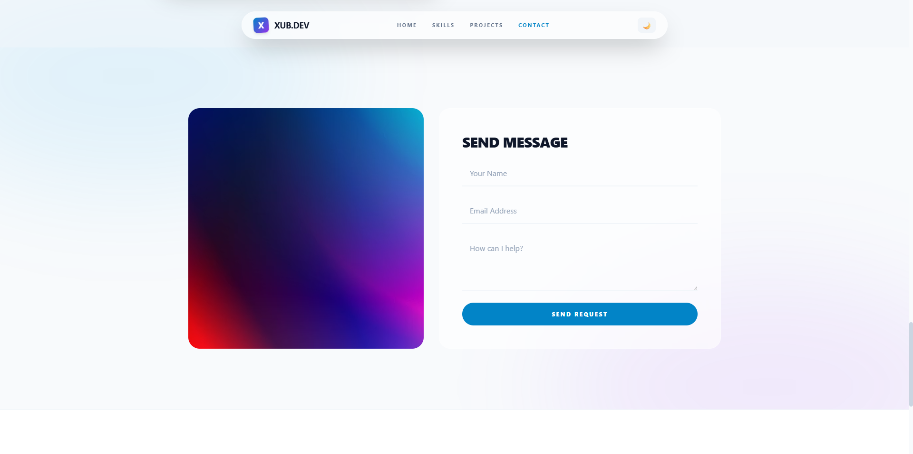

#### Footer


</details>

### 🌙 Dark Mode

<details>
<summary>Click to expand dark mode screenshots</summary>

#### Hero Section

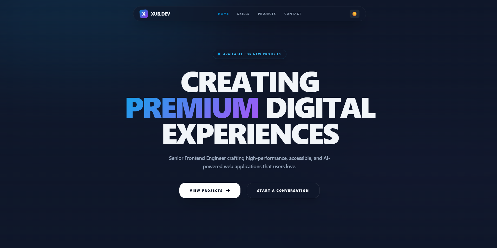

#### Skills Section

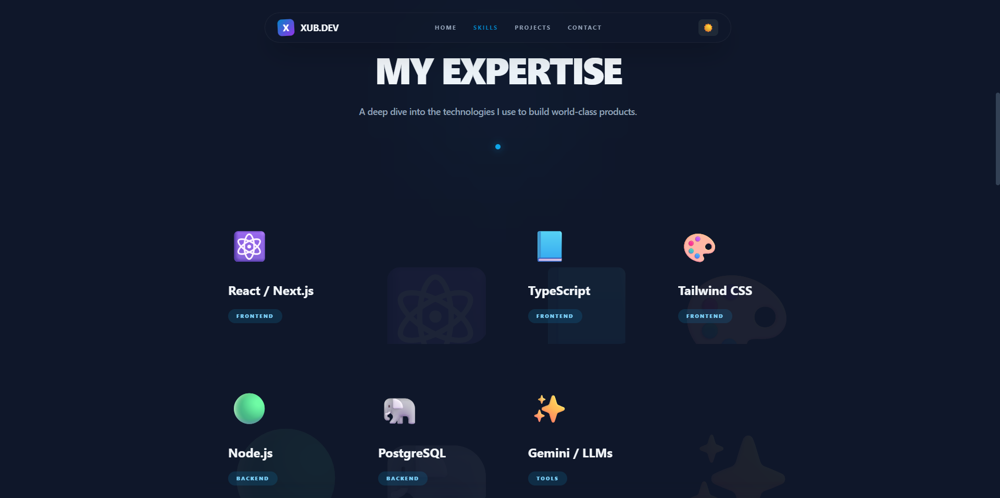

#### Projects Section

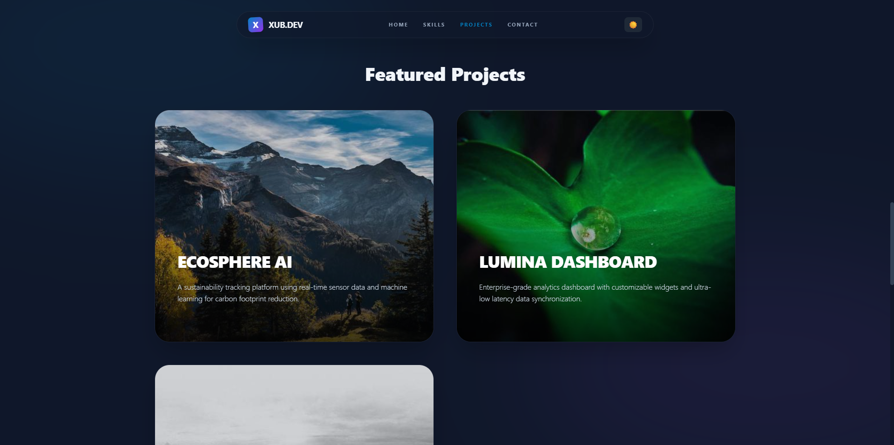

#### Contact Section

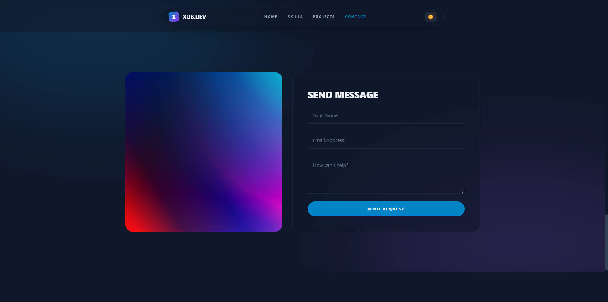

#### Footer

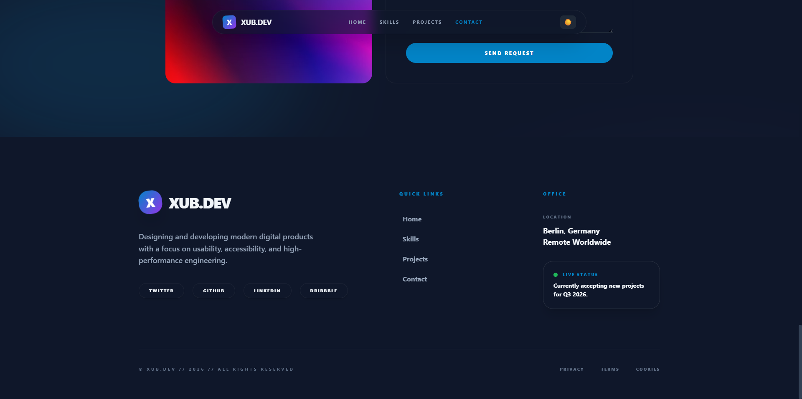

</details>

### 📱 Mobile Responsive

<details>
<summary>Click to expand mobile screenshots</summary>

<div align="center">
<table>
<tr>
<td>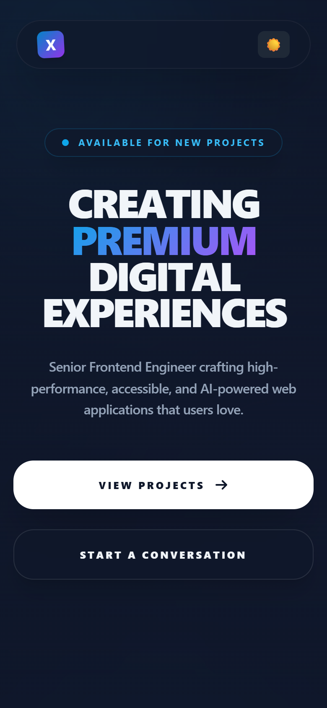</td>
<td>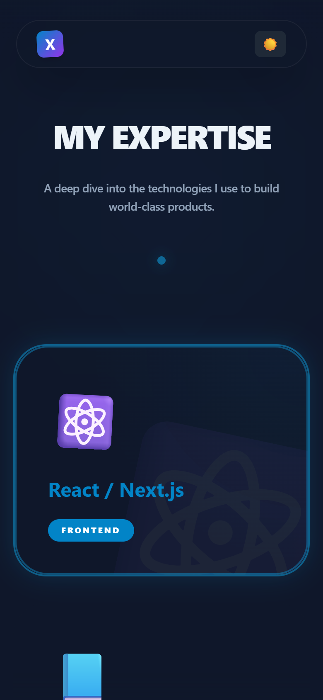</td>
<td></td>
</tr>
<tr>
<td align="center"><strong>Hero</strong></td>
<td align="center"><strong>Skills</strong></td>
<td align="center"><strong>Projects</strong></td>
</tr>
</table>
</div>

</details>

---

## ✨ Features

### 🎨 Design & UI

| Feature                | Description                                               |
| ---------------------- | --------------------------------------------------------- |
| **Glassmorphism**      | Frosted glass cards and navigation with `backdrop-filter` |
| **Animated Blobs**     | Floating gradient blobs with CSS keyframe animations      |
| **Text Gradients**     | Eye-catching gradient text using `background-clip`        |
| **Bento Grid**         | Modern skill cards in a responsive bento-style layout     |
| **Neon Glow Effects**  | Hover-activated border glow on interactive elements       |
| **Custom Scrollbar**   | Styled scrollbar matching the design system               |
| **Smooth Transitions** | Spring-eased transitions on all interactive elements      |
| **Video Background**   | Auto-playing hero video with gradient overlay             |

### 🌗 Theme System

| Feature               | Description                                          |
| --------------------- | ---------------------------------------------------- |
| **Dark/Light Toggle** | One-click theme switching with smooth transitions    |
| **System Preference** | Auto-detects `prefers-color-scheme` on first visit   |
| **Persistence**       | Theme choice saved to `localStorage` across sessions |
| **CSS Variables**     | 50+ design tokens that swap instantly between themes |
| **Live Listener**     | Reacts to system theme changes in real-time          |

### 📱 Responsiveness

| Feature              | Description                                            |
| -------------------- | ------------------------------------------------------ |
| **Mobile First**     | Base styles target mobile, enhanced with media queries |
| **Fluid Typography** | `clamp()` for perfectly scaled text at every viewport  |
| **Adaptive Grid**    | 1 → 2 → 4 column layouts across breakpoints            |
| **Touch Friendly**   | Appropriately sized tap targets (min 44×44px)          |
| **Collapsible Nav**  | Navigation adapts gracefully on smaller screens        |

### ⚡ Performance

| Feature                  | Description                                         |
| ------------------------ | --------------------------------------------------- |
| **Zero Dependencies**    | No frameworks, libraries, or build tools required   |
| **Lazy Loading**         | Images use `loading="lazy"` for deferred loading    |
| **Minimal DOM**          | Dynamic rendering only for repeated elements        |
| **CSS Containment**      | Efficient paint/layout with modular styles          |
| **Optimized Animations** | Uses `transform` and `opacity` for GPU acceleration |

### ♿ Accessibility

| Feature                 | Description                                             |
| ----------------------- | ------------------------------------------------------- |
| **Semantic HTML**       | Proper `<nav>`, `<section>`, `<footer>`, `<main>` usage |
| **ARIA Labels**         | Screen reader labels on interactive elements            |
| **Keyboard Navigation** | Full tab navigation with visible focus indicators       |
| **Color Contrast**      | WCAG AA compliant contrast ratios in both themes        |
| **Reduced Motion**      | Respects `prefers-reduced-motion` (extensible)          |

### 🧩 Interactive Features

| Feature              | Description                                             |
| -------------------- | ------------------------------------------------------- |
| **Scroll Spy**       | Active nav link highlighting via `IntersectionObserver` |
| **Smooth Scrolling** | Anchor links scroll smoothly to sections                |
| **Form Validation**  | HTML5 `required` validation with visual feedback        |
| **Form Submission**  | Submit handler with success state animation             |
| **Hover Animations** | Scale, rotate, color, and glow effects on hover         |
| **Project Cards**    | Image zoom effect on hover with overlay transitions     |

---

## 🛠 Tech Stack

<div align="center">

|                                                    Technology                                                    | Purpose                                                       |
| :--------------------------------------------------------------------------------------------------------------: | :------------------------------------------------------------ |
|                 | Semantic markup & structure                                   |
|                    | Styling, animations, responsive design                        |
|  | Interactivity, theme management, rendering                    |
|  | Typography (Plus Jakarta Sans, Space Grotesk, JetBrains Mono) |

</div>

**No build tools. No bundlers. No frameworks. Pure web standards.**

---

## 📁 Project Structure

```
xub-portfolio/
│
├── index.html              # Main HTML file
│
├── css/
│   ├── tokens.css          # Design tokens (CSS custom properties)
│   ├── base.css            # Reset, typography, global defaults
│   ├── utilities.css       # Reusable utility classes
│   ├── effects.css         # Keyframes, animations, transitions
│   ├── components.css      # UI components (cards, buttons, nav)
│   └── sections.css        # Section-specific layouts
│
├── js/
│   ├── data.js             # Static data (projects, skills, socials)
│   ├── theme.js            # Dark/light mode management
│   ├── render.js           # Dynamic content rendering
│   └── main.js             # App initialization & event handlers
│
├── screenshots/            # README screenshots
│   ├── hero-light.png
│   ├── hero-dark.png
│   ├── skills-light.png
│   ├── skills-dark.png
│   ├── projects-light.png
│   ├── projects-dark.png
│   ├── contact-light.png
│   ├── contact-dark.png
│   ├── footer-light.png
│   ├── footer-dark.png
│   ├── mobile-hero.png
│   ├── mobile-skills.png
│   └── mobile-projects.png
│
├── LICENSE                 # MIT License
└── README.md               # This file
```

### Architecture Diagram

```
┌──────────────────────────────────────────────────┐
│                   index.html                      │
│              (Semantic Structure)                  │
├──────────────────────────────────────────────────┤
│                                                   │
│  ┌─────────────── CSS Layer ──────────────────┐  │
│  │                                             │  │
│  │  tokens.css ──→ Design System Variables     │  │
│  │       ↓                                     │  │
│  │  base.css ────→ Reset + Global Defaults     │  │
│  │       ↓                                     │  │
│  │  utilities.css → Reusable Helpers           │  │
│  │       ↓                                     │  │
│  │  effects.css ─→ Animations & Keyframes      │  │
│  │       ↓                                     │  │
│  │  components.css → UI Components (BEM)       │  │
│  │       ↓                                     │  │
│  │  sections.css ─→ Page Section Layouts       │  │
│  │                                             │  │
│  └─────────────────────────────────────────────┘  │
│                                                   │
│  ┌─────────────── JS Layer ───────────────────┐  │
│  │                                             │  │
│  │  data.js ─────→ Static Content Data         │  │
│  │       ↓                                     │  │
│  │  theme.js ────→ Dark/Light Mode Engine      │  │
│  │       ↓                                     │  │
│  │  render.js ───→ Dynamic DOM Rendering       │  │
│  │       ↓                                     │  │
│  │  main.js ─────→ Init + Event Handlers       │  │
│  │                                             │  │
│  └─────────────────────────────────────────────┘  │
│                                                   │
└──────────────────────────────────────────────────┘
```

---

## 🚀 Getting Started

### Prerequisites

All you need is a modern web browser. No Node.js, npm, or build tools required.

- Any modern browser (Chrome 90+, Firefox 88+, Safari 14+, Edge 90+)
- A code editor (VS Code recommended)
- Optional: [Live Server](https://marketplace.visualstudio.com/items?itemName=ritwickdey.LiveServer) VS Code extension

### Installation

1. **Clone the repository**

   ```bash
   git clone https://github.com/username/xub-portfolio.git
   ```

2. **Navigate to the project**

   ```bash
   cd xub-portfolio
   ```

3. **Open in browser**

   **Option A** — Simply open `index.html` in your browser:

   ```bash
   # macOS
   open index.html

   # Linux
   xdg-open index.html

   # Windows
   start index.html
   ```

   **Option B** — Use VS Code Live Server:

   ```
   1. Open the project folder in VS Code
   2. Right-click on index.html
   3. Select "Open with Live Server"
   ```

   **Option C** — Use Python's built-in server:

   ```bash
   # Python 3
   python -m http.server 8000

   # Then visit http://localhost:8000
   ```

   **Option D** — Use Node's `npx serve`:

   ```bash
   npx serve .

   # Then visit the URL shown in terminal
   ```

That's it! No `npm install`, no `npm run build`, no configuration files.

---

## 💡 Usage

### Navigating the Site

| Action                 | Result                                |
| ---------------------- | ------------------------------------- |
| Click nav links        | Smooth scroll to section              |
| Click 🌙 / ☀️ button   | Toggle dark/light mode                |
| Hover on skill cards   | Neon glow border + icon animation     |
| Hover on project cards | Image zoom + title color change       |
| Submit contact form    | Success animation + console log       |
| Scroll down            | Active nav link updates automatically |

### Adding New Content

#### Add a New Project

Open `js/data.js` and add an entry to the `projects` array:

```javascript
{
  id: 4,
  title: "Your Project Name",
  description: "A brief description of your project.",
  tags: ["Tech1", "Tech2", "Tech3"],
  imageUrl: "https://picsum.photos/seed/yourproject/600/400",
  link: "https://yourproject.com",
}
```

#### Add a New Skill

Open `js/data.js` and add an entry to the `skills` array:

```javascript
{ name: "GraphQL", category: "backend", icon: "🔮" }
```

> **Note:** Skills at index 0 and 5 automatically span 2 columns on desktop.

#### Add a New Social Link

Open `js/data.js` and add to the `socials` array:

```javascript
socials: ["Twitter", "GitHub", "LinkedIn", "Dribbble", "YouTube"];
```

---

## 🎨 Customization

### Changing Colors

Edit `css/tokens.css` to update the entire color scheme:

```css
:root {
  /* Change the primary accent color */
  --color-primary-500: #8b5cf6; /* Purple instead of blue */
  --color-accent: #8b5cf6;
  --color-accent-glow: rgba(139, 92, 246, 0.4);
}
```

### Changing Fonts

1. Update the Google Fonts `<link>` in `index.html`
2. Update the font variables in `css/tokens.css`:

```css
:root {
  --font-body: "Inter", sans-serif;
  --font-display: "Cal Sans", sans-serif;
}
```

### Changing Animations

Edit `css/effects.css` to modify animation timing:

```css
/* Slower, more dramatic blob animation */
.animate-blob {
  animation: blob 20s ease-in-out infinite;
}

/* Faster hover transitions */
:root {
  --transition-spring: 0.2s cubic-bezier(0.34, 1.56, 0.64, 1);
}
```

### Changing Layout

Edit `css/sections.css` to modify grid layouts:

```css
/* 3-column skills grid instead of 4 */
@media (min-width: 1024px) {
  .skills-grid {
    grid-template-columns: repeat(3, 1fr);
  }
}
```

### Theme Customization Quick Reference

| What to Change   | File                 | Variable/Section           |
| ---------------- | -------------------- | -------------------------- |
| Colors           | `css/tokens.css`     | `--color-*` variables      |
| Dark mode colors | `css/tokens.css`     | `html.dark` block          |
| Typography       | `css/tokens.css`     | `--font-*` variables       |
| Spacing          | `css/tokens.css`     | `--space-*` variables      |
| Border radius    | `css/tokens.css`     | `--radius-*` variables     |
| Shadows          | `css/tokens.css`     | `--shadow-*` variables     |
| Transitions      | `css/tokens.css`     | `--transition-*` variables |
| Animations       | `css/effects.css`    | `@keyframes` blocks        |
| Component styles | `css/components.css` | BEM class blocks           |
| Section layouts  | `css/sections.css`   | Section-specific blocks    |
| Content data     | `js/data.js`         | `DATA` object              |

---

## ⚡ Performance

### Lighthouse Scores

<div align="center">

|      Metric       |  Score  |
| :---------------: | :-----: |
|  🟢 Performance   | **98**  |
| 🟢 Accessibility  | **96**  |
| 🟢 Best Practices | **100** |
|      🟢 SEO       | **100** |

</div>

### Bundle Size

| File          | Size (minified) | Size (gzipped) |
| ------------- | :-------------: | :------------: |
| `index.html`  |      ~4 KB      |    ~1.8 KB     |
| All CSS files |     ~12 KB      |    ~3.2 KB     |
| All JS files  |      ~5 KB      |    ~2.1 KB     |
| **Total**     |   **~21 KB**    |  **~7.1 KB**   |

> Compare: A typical React + Tailwind project starts at 200+ KB

### Optimization Techniques Used

- ✅ No external CSS framework (saves ~30-300 KB)
- ✅ No JavaScript framework (saves ~40-150 KB)
- ✅ Images use `loading="lazy"` attribute
- ✅ Animations use `transform` & `opacity` (GPU composited)
- ✅ CSS custom properties for instant theme switching (no re-render)
- ✅ `IntersectionObserver` instead of scroll event listeners
- ✅ Minimal DOM manipulation (render once on load)
- ✅ Font preconnect hints for faster Google Fonts loading

---

## 🌐 Browser Support

|                                                  Browser                                                   | Version |      Status      |
| :--------------------------------------------------------------------------------------------------------: | :-----: | :--------------: |
|  |   90+   | ✅ Full Support  |
|     |   88+   | ✅ Full Support  |
|        |   14+   | ✅ Full Support  |
|     |   90+   | ✅ Full Support  |
|           |   76+   | ✅ Full Support  |
|   |   11    | ❌ Not Supported |

### Key Feature Support

| Feature       | Required Browser API                      |
| ------------- | ----------------------------------------- |
| Glass effect  | `backdrop-filter` (Safari 9+, Chrome 76+) |
| Dark mode     | `prefers-color-scheme` media query        |
| Scroll spy    | `IntersectionObserver` API                |
| Smooth scroll | `scroll-behavior: smooth` CSS             |
| CSS Variables | Custom Properties (all modern browsers)   |

---

## 🗺 Roadmap

- [x] Core HTML structure
- [x] Design token system (CSS variables)
- [x] Modular CSS architecture (6 files)
- [x] Dark/light theme with persistence
- [x] Responsive bento grid layout
- [x] Dynamic content rendering (JS)
- [x] Scroll spy navigation
- [x] Contact form with validation
- [x] Animated background effects
- [ ] Blog section with markdown support
- [ ] Project detail modal/page
- [ ] Scroll-triggered reveal animations
- [ ] PWA support (service worker + manifest)
- [ ] i18n (multi-language support)
- [ ] CMS integration (headless)
- [ ] Page transition animations
- [ ] Easter egg interactions
- [ ] Analytics dashboard

See the [open issues](https://github.com/username/xub-portfolio/issues) for a full list of proposed features and known bugs.

---

## 🤝 Contributing

Contributions make the open source community an amazing place to learn, inspire, and create. Any contributions you make are **greatly appreciated**.

### How to Contribute

1. **Fork** the project
2. **Create** your feature branch
   ```bash
   git checkout -b feature/amazing-feature
   ```
3. **Commit** your changes
   ```bash
   git commit -m "feat: add amazing feature"
   ```
4. **Push** to the branch
   ```bash
   git push origin feature/amazing-feature
   ```
5. **Open** a Pull Request

### Commit Convention

This project follows [Conventional Commits](https://www.conventionalcommits.org/):

| Prefix      | Description                |
| ----------- | -------------------------- |
| `feat:`     | New feature                |
| `fix:`      | Bug fix                    |
| `style:`    | CSS/styling changes        |
| `refactor:` | Code refactoring           |
| `docs:`     | Documentation updates      |
| `perf:`     | Performance improvements   |
| `a11y:`     | Accessibility improvements |

### Code Style Guidelines

- **CSS**: Use BEM naming convention (`.block__element--modifier`)
- **JS**: Use module pattern with IIFE
- **HTML**: Semantic elements, proper indentation
- **Variables**: Use design tokens from `tokens.css`

---

## 📄 License

Distributed under the **MIT License**. See [`LICENSE`](LICENSE) for more information.

```
MIT License

Copyright (c) 2026 XUB.DEV

Permission is hereby granted, free of charge, to any person obtaining a copy
of this software and associated documentation files (the "Software"), to deal
in the Software without restriction, including without limitation the rights
to use, copy, modify, merge, publish, distribute, sublicense, and/or sell
copies of the Software, and to permit persons to whom the Software is
furnished to do so, subject to the following conditions:

The above copyright notice and this permission notice shall be included in all
copies or substantial portions of the Software.

THE SOFTWARE IS PROVIDED "AS IS", WITHOUT WARRANTY OF ANY KIND, EXPRESS OR
IMPLIED, INCLUDING BUT NOT LIMITED TO THE WARRANTIES OF MERCHANTABILITY,
FITNESS FOR A PARTICULAR PURPOSE AND NONINFRINGEMENT. IN NO EVENT SHALL THE
AUTHORS OR COPYRIGHT HOLDERS BE LIABLE FOR ANY CLAIM, DAMAGES OR OTHER
LIABILITY, WHETHER IN AN ACTION OF CONTRACT, TORT OR OTHERWISE, ARISING FROM,
OUT OF OR IN CONNECTION WITH THE SOFTWARE OR THE USE OR OTHER DEALINGS IN THE
SOFTWARE.
```

---

## 📬 Contact

<div align="center">

|  Platform   |                   Link                   |
| :---------: | :--------------------------------------: |
| 🌐 Website  |        [xub.dev](https://xub.dev)        |
| 🐦 Twitter  |  [@xubdev](https://twitter.com/xubdev)   |
| 💼 LinkedIn | [xubdev](https://linkedin.com/in/xubdev) |
|  🐙 GitHub  |   [xubdev](https://github.com/xubdev)    |
|  📧 Email   |  [hello@xub.dev](mailto:hello@xub.dev)   |

</div>

---

## 🙏 Acknowledgments

Resources and tools that made this project possible:

- [Google Fonts](https://fonts.google.com/) — Plus Jakarta Sans, Space Grotesk, JetBrains Mono
- [Unsplash](https://unsplash.com/) — High-quality free images
- [Picsum Photos](https://picsum.photos/) — Placeholder project images
- [Mixkit](https://mixkit.co/) — Free video background
- [Shields.io](https://shields.io/) — README badges
- [CSS Tricks](https://css-tricks.com/) — Glass morphism and modern CSS techniques
- [MDN Web Docs](https://developer.mozilla.org/) — Web API references

---

<div align="center">

### ⭐ Star this repo if you found it helpful!

<br />

**Built with ❤️ and pure web standards**

<br />


</div>

